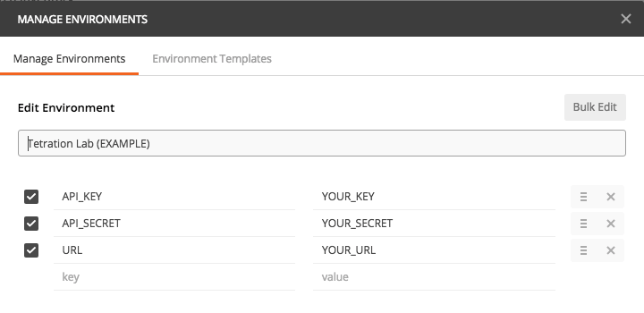

# Using Postman with the Tetration REST API

The Tetration REST API uses a highly secure digest authentication based on a Public and Private API keys that help generate unique headers for every API request.  The digest is calculated leveraging the Private API key, a timestamp, and the message body.  This means that the Private Key is never sent in the actual request.  A single authorization header can both verify identity and integrity of the message, and the authorization code will never be re-used.  Thus, even if the message is sent in the clear and intercepted by a man-in-the-middle, they would not be able to access the API.  The generation of these custom headers is built into the Python library, but if we want to use Postman, we have to add a custom Pre-request script to our requests.
 
Specifically, the headers are as follows:
* **'Id'**: Your Tetration Public API key
* **'Timestamp'**: A UTC Timestamp in a specific format.  Example: 2017-06-19T17:15:32+0000
* **'Content-type'**: 'application/json'
* **'X-Tetration-Cksum'**: This is only used in POST and PUT requests and is a hash of the body being posted with SHA256 and encoded in Hex.  This ensures that the body is not tampered with in-flight.  Will be unique to any specific post or put body.
* **'Authorization'**: An HMAC-SHA256 digest with the request method, URL, X-Tetraiton-Cksum header, Content-type header, Timestamp header and the API Secret Key.  Used in all requests and will be unique to EVERY request. [Hash-based Message Authentication Code (Wikipedia)](https://en.wikipedia.org/wiki/Hash-based_message_authentication_code)
 
To set up Postman, you will need to create a Tetration Environment with the following variables:


 

IMPORTING THE COLLECTION:

`Tetration Lab (EXAMPLE).postman_environment.json` and `Cisco Secure Workload 3.5 - OpenAPI.postman_collection.json` can be imported to set up everything required to start making requests.  The sample Postman collection includes requests for the "Applications and Security Policies" related API calls.


MANUAL WALKTHROUGH:

>The pre-request script was recently updated to set the appropriate headers without having to pre-set them in the request.  This makes > usage much easier.  To leverage this method, use "pre-request.js" either as a pre-request script in an individual request, or as a pre-request script for an entire collection.  You can also apply the pre-request script to a Folder, so that it doesn't have to be individualy applied to multiple requests.

Create a new request.  As an example, try an inventory search which is a Post request to the Tetration API and will use all both generated digest headers.  The URL for the request will be: 'https://{{URL}}/openapi/v1/inventory/search'.  The Method is 'POST'.  Click on the 'Authorization' tab.  Authorization should be set to 'No Auth' since we will be adding custom code for Authorization.
 
Click on the 'Pre-request Script' tab and paste the Javascript `pre-request.js` in this repository.  This code will be the same for all requests to the Tetration API and generates the custom headers.
 
Create a Body according to the Tetration API documentation, and send your request.  Below is an example JSON search for Windows hosts in the inventory:
``` 
{
    "filter": {
       "type": "and",
       "filters": [
          {
             "type": "contains",
             "field": "os",
             "value": "Server2012"
          }
       ]
    },
    "scopeName": "Tetrationmicrosoft",
    "limit": 100
}
```

Hit send, and you should see a successful request to the Tetration API with a JSON formatted response.